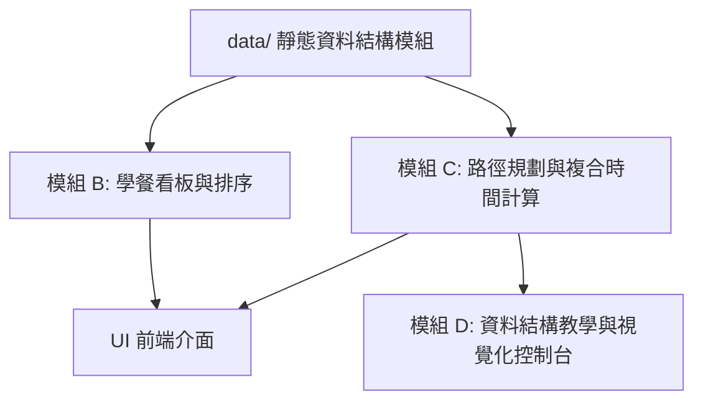

# Product Requirements Document (PRD) - 校園學餐等待時間規劃系統

本文件詳細規範「校園學餐等待時間規劃系統」之產品需求、系統模組架構、核心演算法邏輯與資料結構設計。

---

## 1. 系統模組架構

系統主要由以下四個模組組成，皆於前端瀏覽器內運行，不涉及任何伺服器與資料庫：



---

## 2. 模組詳細邏輯與運作流程

### 模組 A：靜態資料結構模組 (Mock Data Layer)
此模組定義系統運作所需的基本實體與連接關係，劃分為兩個靜態 JavaScript 檔案：

1. **學餐資料陣列 (`restaurantData.js`)**
   - **結構**：使用物件陣列 (Array of Objects) 儲存。
   - **欄位設計**：
     ```javascript
     {
       id: String,          // 餐廳唯一識別碼
       name: String,        // 餐廳名稱
       type: String,        // 餐點類型 (如：自助餐、麵食、速食)
       waitTime: Number,    // 即時預估等待/排隊製作時間 (分鐘)
       popularFood: String, // 招牌餐點
       image: String        // 示意圖網址 (本機或靜態 URL)
     }
     ```

2. **校園地圖路徑圖 (`campusGraph.js`)**
   - **結構**：使用 **鄰接串列 (Adjacency List)** 表示校園大樓與學餐餐廳的無向帶權圖 (Undirected Weighted Graph)。節點 (Vertices) 代表大樓或餐廳，邊的權重 (Edges Weight) 代表兩點之間的步行時間（分鐘）。
   - **欄位設計**：
     ```javascript
     {
       nodes: Array<String>, // 所有校園節點名稱 (例如: "第一教學大樓", "第一學餐")
       adjacencyList: {
         "第一教學大樓": [{ to: "圖書館", weight: 3 }, { to: "第一學餐", weight: 5 }],
         "圖書館": [{ to: "第一教學大樓", weight: 3 }, { to: "活動中心", weight: 4 }],
         ...
       }
     }
     ```

---

### 模組 B：學餐看板與排序模組 (Dashboard & Sorting)
此模組負責展示所有學餐餐廳的當前等待狀態，並提供基於等待時間的排序功能。

1. **等待時間狀態分類邏輯**：
   根據 `waitTime` 將餐廳狀態分類並以不同燈號顏色渲染於 UI：
   - **綠色 (安全)**：等待時間 $\le 10$ 分鐘。
   - **黃色 (警告)**：$10 <$ 等待時間 $\le 20$ 分鐘。
   - **紅色 (擁擠)**：等待時間 $> 20$ 分鐘。

2. **排序邏輯 (自訂排序演算法)**：
   為了切合資料結構課程主旨，本模組除了 JS 內建排序外，額外實作一組 **自訂氣泡排序 (Bubble Sort) 或 插入排序 (Insertion Sort)**。
   - **輸入**：未排序的餐廳陣列。
   - **處理過程**：依據餐廳的 `waitTime` 進行升冪排序，並將排序時的交換步驟記錄下來，供模組 D 展示。
   - **輸出**：排序後的餐廳物件陣列。

---

### 模組 C：路徑規劃與複合時間計算模組 (Pathfinding & Time Calculator)
此模組計算使用者從目前大樓走到目標餐廳並拿到餐點的總時間，幫助評估是否會遲到。

1. **核心演算法：戴克斯特拉演算法 (Dijkstra's Algorithm)**
   - **目的**：在帶權圖中，找出從「起始大樓」到「目標餐廳」的最短步行路徑與其對應的最短步行時間。
   - **演算法虛擬碼與邏輯**：
     1. 建立一個距離字典 `distances`，將起點設為 `0`，其他所有節點設為 `Infinity`。
     2. 建立一個 `visited` 集合記錄已尋訪節點。
     3. 建立一個優先佇列 (Priority Queue) 或最小陣列，將 `(起點, 0)` 放入。
     4. 當優先佇列不為空時：
        - 取出目前距離最小的節點 `u`。
        - 若 `u` 已在 `visited` 中，則跳過。
        - 將 `u` 加入 `visited`。
        - 尋訪 `u` 的所有鄰接節點 `v`：
          - 計算新距離 `altDist = distances[u] + weight(u, v)`。
          - 若 `altDist < distances[v]`，則更新 `distances[v] = altDist`，並記錄其前驅節點 `parent[v] = u`，以便回溯路徑。
          - 將 `(v, distances[v])` 放入佇列。
     5. 演算法終止後，透過 `parent` 回溯起點到終點的節點順序，得到完整步行路線（例如：第一教學大樓 $\to$ 圖書館 $\to$ 第一學餐）。

2. **複合時間計算公式**：
   $$\text{總預估時間} (T_{\text{total}}) = \text{最短步行時間} (T_{\text{walk}}) + \text{學餐排隊等待時間} (T_{\text{wait}})$$

3. **遲到警示邏輯**：
   - 使用者可選擇「後續行程的時間點」（例如：13:00）。
   - **時間比對運作邏輯**：
     1. 系統抓取當前的模擬時間點（格式為 `HH:MM`，例如 `12:15`，分秒與本機時間同步，小時固定為 `12` 代表午餐模擬時間）。
     2. 將當前模擬時間與複合預估時間 $T_{\text{total}}$（分鐘）加總，得出預計取得餐點的抵達時間點 $T_{\text{arrival}}$。
     3. 比對 $T_{\text{arrival}}$ 與使用者設定的行程時間點 $T_{\text{schedule}}$：
        - 若 $T_{\text{arrival}} > T_{\text{schedule}}$，UI 顯示紅色衝突警示「⚠️ 預計將於 X:X 取得餐點，已遲於後續行程時間 Y:Y！您將會遲到！」。
        - 若 $T_{\text{arrival}} \le T_{\text{schedule}}$，UI 顯示綠色安全警示「✅ 時間充裕！預計將於 X:X 取得餐點，早於後續行程時間 Y:Y。」。

---

### 模組 D：資料結構教學與視覺化控制台 (Educational Console)
此模組是本專案的「報告亮點」，用於將後台運行的演算法視覺化呈現在畫面上。

1. **路徑計算過程視覺化**：
   - 當 Dijkstra 演算法執行時，將尋訪節點的步驟（例如：「正在鬆弛邊... 更新節點 A 到節點 B 的距離為 5」）輸出成動態 Log 顯示於畫面上。
   - 在網頁上繪製簡化的校園圖形（節點與邊），並用顏色高亮標示出 Dijkstra 計算出來的最短路徑。

2. **排序過程紀錄**：
   - 點擊排序時，顯示自訂排序演算法的交換次數與時間複雜度說明 ($O(N^2)$ vs $O(N \log N)$)。

---

## 3. 使用者介面 (UI) 規格與佈局

網頁採單頁響應式設計 (Single Page Application)，版面分為三大區塊：

1. **頂部導覽列 (Navbar)**：系統標題「校園學餐等待時間規劃系統」及當前模擬時間。
2. **左側：學餐即時狀態看板 (Restaurant Board)**：
   - 頂部有「依等待時間排序」按鈕。
   - 看板內渲染餐廳卡片，每張卡片包含：餐廳名稱、圖片、招牌菜、等待時間標籤（帶有紅/黃/綠動態光暈）。
3. **右側上方：等待時間規劃機 (Calculator)**：
    - 起點選擇下拉選單（載入 `campusGraph.js` 的所有大樓節點）。
    - 終點選擇下拉選單（載入所有學餐節點）。
    - 後續行程的時間點選擇框（例如 13:00）。
   - 「開始規劃」按鈕。
   - 結果顯示區：
     - 最短步行路徑：大樓 A $\to$ 大樓 B $\to$ 餐廳 C
     - 時間加總明細：步行 X 分鐘 + 排隊 Y 分鐘 = 總計 Z 分鐘。
     - 遲到警示文字與底色。
4. **右側下方：資料結構教學區 (Data Structure Explanation)**：
   - Dijkstra 演算法尋訪狀態與路徑追蹤紀錄。
   - 資料結構使用說明（為何在此處選用 Graph 及 Array）。
